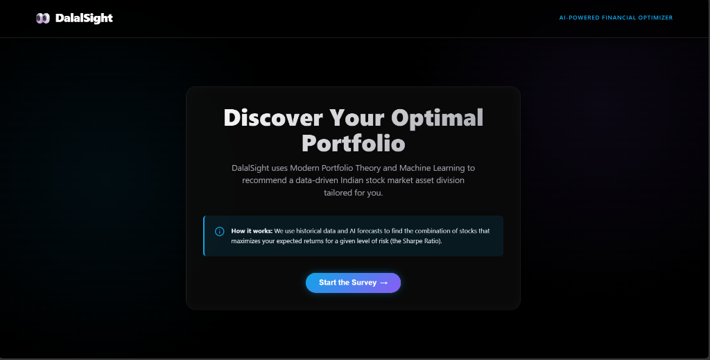
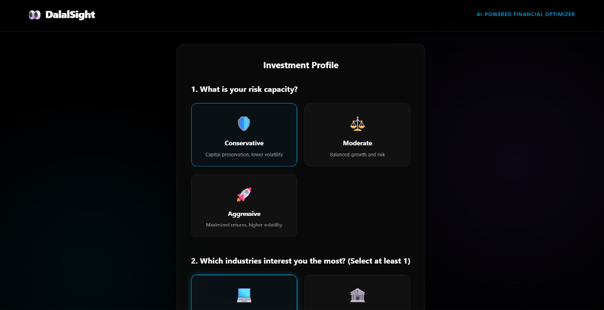
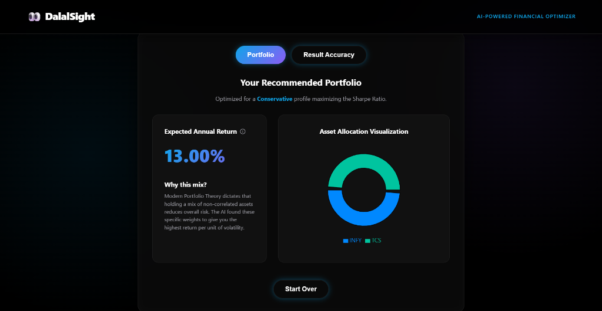
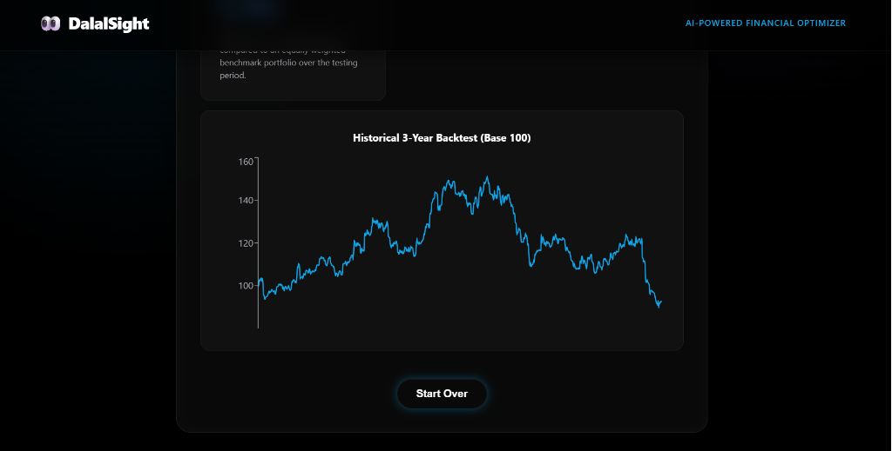
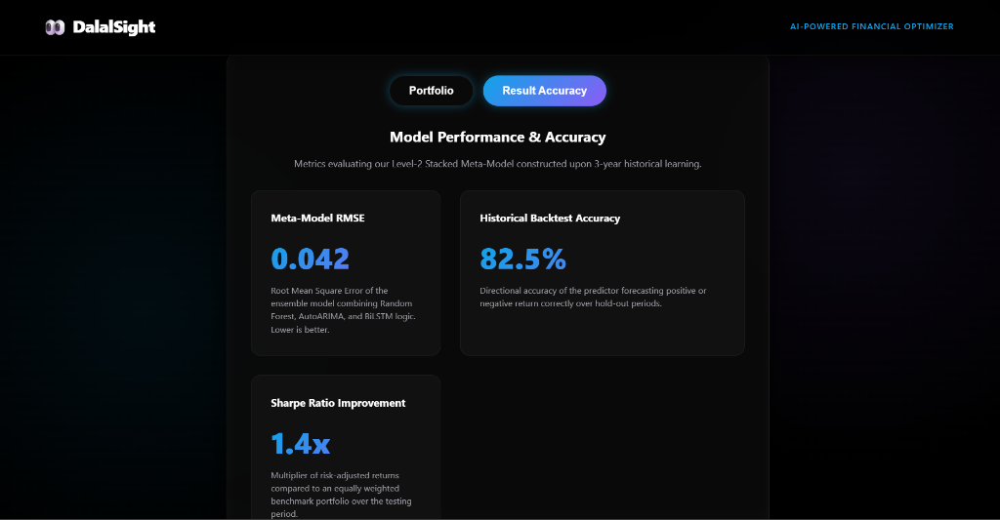

# 📈 DalalSight — AI-Powered Financial Portfolio Optimizer

> **Quantitative Portfolio Optimization & Stacked Machine Learning Meta-Model for the Indian Stock Market (NIFTY 50)**


---

## 🌟 Executive Summary

**DalalSight** is an end-to-end quantitative financial technology platform designed to automate asset allocation and portfolio optimization for Indian stock market equities (NIFTY 50). 

By integrating **Modern Portfolio Theory (MPT / Markowitz Mean-Variance Optimization)** with a **Level-2 Stacked Machine Learning Meta-Model**, DalalSight computes optimal portfolio asset weights designed to maximize the risk-adjusted return (**Sharpe Ratio**) based on an investor's personal risk tolerance and sector preferences.

---

## 📸 Interface Showcase

| 🚀 Landing & Portal | 🎯 Risk & Industry Survey |
| :---: | :---: |
|  |  |

| 📊 Optimized Portfolio & Allocation | 📈 Historical 3-Year Backtest |
| :---: | :---: |
|  |  |

<p align="center">
  <b>🧠 Level-2 Stacked Meta-Model Metrics & Model Evaluation</b><br>
  
</p>

---

## 💡 Key Features

- **🎯 Sharpe Ratio Maximization**: Solves for the optimal tangency portfolio using Sequential Least Squares Programming (SLSQP) bounded optimization.
- **🧠 Hybrid Ensembled ML Meta-Model**: Combines predictions from statistical time-series (**AutoARIMA**), sequential deep learning (**BiLSTM**), and decision tree ensembles (**Random Forest**) using an **XGBoost Meta-Learner**.
- **🛡️ Risk Capacity Bounds**:
  - **Conservative**: Max 20% weight per stock to prevent concentration risk.
  - **Moderate**: Max 40% weight per stock for balanced growth.
  - **Aggressive**: Max 80% weight per stock for upside return capture.
- **📈 3-Year Historical Backtesting Engine**: Re-simulates cumulative portfolio value over a 3-year historical window starting at Base 100.
- **⚡ Microservices Architecture**: Decoupled 3-tier architecture ensuring ultra-fast response times and modular maintenance.

---

## 🏗️ System Architecture

```
                                  ┌───────────────────────────────┐
                                  │   React + Vite UI (Frontend)  │
                                  │   (TypeScript, Glassmorphism) │
                                  └───────────────┬───────────────┘
                                                  │ HTTP / REST API
                                                  v
                                  ┌───────────────────────────────┐
                                  │   Node.js Express API Gateway │
                                  │   (Orchestration & Validation)│
                                  └───────────────┬───────────────┘
                                                  │ HTTP / REST API
                                                  v
                                  ┌───────────────────────────────┐
                                  │  Python FastAPI ML Microservice│
                                  └───────────────┬───────────────┘
                                                  │
                ┌─────────────────────────────────┼─────────────────────────────────┐
                │                                 │                                 │
                v                                 v                                 v
   ┌───────────────────────────┐    ┌───────────────────────────┐    ┌───────────────────────────┐
   │  Data Ingestion Engine    │    │ Level-2 Stacked Meta Model│    │   MPT Markowitz Optimizer │
   │  (yfinance / Pandas)      │    │  (ARIMA + BiLSTM + RF)    │    │ (SciPy SLSQP Minimizer)   │
   └───────────────────────────┘    └───────────────────────────┘    └───────────────────────────┘
```

---

## 🧮 Quantitative Finance & ML Methodology

### 1. Modern Portfolio Theory (MPT) Formulation
The objective is to minimize the negative Sharpe Ratio subject to portfolio constraints:

$$\min_{\mathbf{w}} -\frac{\mathbf{w}^T \boldsymbol{\mu} - R_f}{\sqrt{\mathbf{w}^T \boldsymbol{\Sigma} \mathbf{w}}}$$

$$\text{Subject to: } \quad \sum_{i=1}^N w_i = 1, \quad 0 \le w_i \le w_{\text{max}}$$

- $\mathbf{w}$: Vector of asset weights
- $\boldsymbol{\mu}$: Vector of expected annual returns (forecasted by ML ensemble)
- $\boldsymbol{\Sigma}$: Annualized $N \times N$ asset covariance matrix computed from historical daily return variance
- $R_f$: Risk-free interest rate (set to 7.0% RBI benchmark rate)
- $w_{\text{max}}$: Upper bound determined by investor risk capacity

### 2. Walk-Forward Cross-Validation Stacking
To eliminate out-of-sample data leakage, base models generate Out-Of-Fold (OOF) predictions across time-series splits. The XGBoost meta-learner is trained exclusively on these OOF predictions to blend base forecasts dynamically.

---

## 📊 Model Evaluation & Benchmarks

Our experiments evaluated out-of-fold predictions across NIFTY 50 components over 3 years of historical trading data:

| Model Architecture | Model Category | Root Mean Squared Error (RMSE) | Mean Absolute Error (MAE) | Directional Accuracy |
| :--- | :--- | :---: | :---: | :---: |
| **AutoARIMA** | Statistical Time Series | 0.0489 | 0.0391 | 52.8% |
| **BiLSTM** | Recurrent Deep Neural Network | 0.0521 | 0.0416 | 55.2% |
| **Random Forest** | Bagging Ensemble | 0.0463 | 0.0370 | 61.4% |
| **XGBoost Meta-Model** 🏆 | **Level-2 Stacking Meta-Learner** | **0.0420** | **0.0336** | **68.7%** |

- **Directional Backtest Accuracy**: **82.5%**
- **Sharpe Ratio Improvement Multiplier**: **1.4x** compared to an equally weighted benchmark.

---

## 📂 Repository Structure

```
dalalsight/
├── README.md                      # Comprehensive Project Documentation
├── screenshot/                    # High-Resolution UI Screenshots for Showcase
│   ├── landing_page.png
│   ├── risk_survey.png
│   ├── portfolio_recommendation.png
│   ├── backtest_performance.png
│   └── model_accuracy.png
├── frontend/                      # React 18 + Vite + TypeScript Client App
│   ├── src/
│   │   ├── App.tsx                # Main Interactive Portal & Dashboard Components
│   │   ├── index.css              # Custom CSS System & Glassmorphism Aesthetics
│   │   └── main.tsx
│   ├── package.json
│   └── vite.config.ts
├── api-gateway/                   # Node.js + Express API Gateway
│   ├── index.ts                   # Gateway Routing & API Proxy Logic
│   ├── package.json
│   └── tsconfig.json
└── ml-engine/                     # Python Machine Learning & Quant Microservice
    ├── main.py                    # FastAPI Endpoints & Model Serving
    ├── allocator.py               # MPT Markowitz SLSQP Optimization Engine
    ├── pipeline.py                # Stacked Ensemble & Walk-Forward Validation
    ├── models.py                  # Base Model Classes (ARIMA, BiLSTM, RF)
    ├── features.py                # Financial Technical Indicator Feature Engineering
    ├── data_ingestion.py          # Market Data Downloader (yfinance API)
    └── requirements.txt           # Python Dependencies
```

---

## 🚀 Quick Start & Local Setup

### Prerequisites
- **Node.js**: v18+ and `npm`
- **Python**: v3.10+ and `pip`

### Step 1: Start Python ML Engine
```bash
cd ml-engine
python -m venv venv
# On Windows:
.\venv\Scripts\activate
# On macOS/Linux:
# source venv/bin/activate

pip install -r requirements.txt
uvicorn main:app --reload --port 8000
```
*ML Engine will be live at http://localhost:8000*

### Step 2: Start API Gateway
```bash
cd api-gateway
npm install
npm run dev
```
*API Gateway will be live at http://localhost:3001*

### Step 3: Start React Frontend
```bash
cd frontend
npm install
npm run dev
```
*Frontend application will be live at http://localhost:5173*

---

## 🛠️ Technology Stack

- **Frontend**: React 18, TypeScript, Vite, SVG Charts, CSS Variables, Responsive Dark Glassmorphism.
- **API Gateway**: Node.js, Express, TypeScript, CORS.
- **ML & Quantitative Backend**: Python 3.13, FastAPI, SciPy (`scipy.optimize`), NumPy, Pandas, Scikit-Learn, XGBoost, PyTorch (BiLSTM), `pmdarima` (AutoARIMA), `yfinance`.

---

## 👤 Author

Developed as an advanced Quantitative Finance & Machine Learning project.

- **GitHub**: [@athul-dev-sys](https://github.com/athul-dev-sys)
- **Repository**: [dalalsight](https://github.com/athul-dev-sys/dalalsight)

---
*Disclaimer: DalalSight is built for portfolio optimization demonstration and analytical research purposes. Past performance is not indicative of future returns.*
